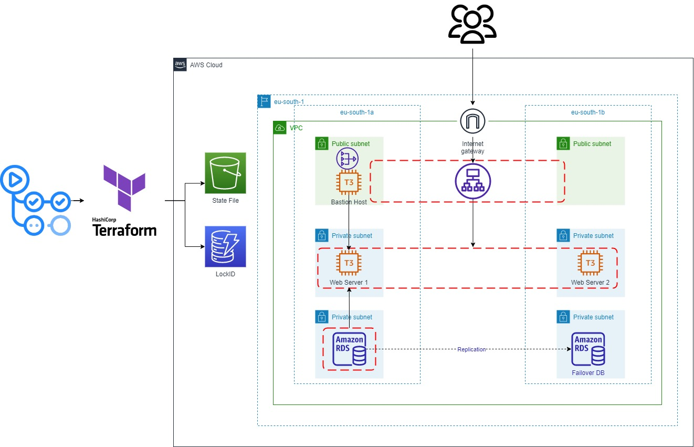

# Deploying AWS 3-Tier Webapp with Terraform, Docker, and GitHub Actions (CI/CD) Pipeline

## Project Structure


## Project Description
- Dockerize a Flask app (Monty Hall Game) and push it to AWS Elastic Container Registry (ECR).
- Deploy AWS Infrastructure using Terraform modules.
- Provision EC2 Instances and pull latest Docker image and run it.
- Finally: You will have a container running flask app on 2 EC2 Instances behind Application Load Balancer.


## Technologies Used in Detail: 
1. **Terraform (IaC)**: To deploy AWS Infrastructure resources using Terraform modules.
2. **AWS Resources**:
	- VPC (2 Public Subnets, 4 Private Subnets, Elastic IP, Nat Gateway, Internet Gateway).
	- 3 EC2 Instances (two for hosting the app and bastion host to ssh), and Application Load Balancer.
	- RDS, and Elasticache.
	- S3 and Dynamodb: to store state file and lock it.
	- Security Groups.
3. **Docker**: To dockerize my Flask application using a Dockerfile.
4. **GitHub Actions (CI/CD) Pipeline**: To do these Jobs on every git push command, also manually triggered:
	- Automate the Infrastructure building and destroying process.
	- Provision the EC2 Instances (Install and configure Docker).
	- Build, push docker image to AWS ECR, then pull and run docker container in the ec2 instance.


## How to Try This Project:
- Clone This repo.
- Push it to GitHub or Fork the repo in the first place.
- Add GitHub Secrets from the settings of the repo.
```yaml
  AWS_ACCESS_KEY_ID: ${{ secrets.AWS_ACCESS_KEY_ID }} # YOUR AWS User KeyID.
  AWS_SECRET_ACCESS_KEY: ${{ secrets.AWS_SECRET_ACCESS_KEY }} # YOUR AWS User Credentials.
  EC2_PRIVATE_SSH_KEY: ${{ secrets.AWS_EC2_SSH_PRIVATE_KEY }} # Used to ssh into EC2.
  EC2_PUBLIC_SSH_KEY: ${{ secrets.AWS_SSH_PUBLIC_KEY }} # Used to upload public key to aws.
```
> To add **AWS Credentials** see the content of `~/.aws/config`
> If you didn't see anything Install AWS CLI then do this command `aws configure` and provide your info here because you will use it in the future.

> To add **public and private SSH Keys** use these commands
```bash
ssh-keygen # name = ssh_key_aws ,then enter enter 
chmod 400 ssh_key_aws
cat ssh_key_aws # paste the content into GitHub Secrets EC2_PRIVATE_SSH_KEY
cat ssh_key_aws.pub # paste the content into GitHub Secrets EC2_PUBLIC_SSH_KEY
```
- Now you are ready to trigger the pipeline: Go to Actions tab and click on the name of the workflow `Build AWS Infrastructure and Deploy Dockerized Flask-App on it.` then click on run work flow.
- To see the website go to your aws account and click on your loadbalancer and open its public DNS.
- **IMPORTANT**: Destroy the resources after you finish because it will get pricy very fast.
### How to Destroy AWS Resources:
- Run the GitHub Actions Workflow again (manually) and choose destroy when prompted to run the workflow.
- If that fails for any reason, go to your account and destroy every resource from there manually to not get a high bill.


## To-Do List
- [ ] Provisoin EC2 Instances using Ansible.
- [ ] Send email to me using lambda once the terraform state file change.

## Resources and Note
1. [GitHub Action Tutorial by Nana.](https://www.youtube.com/watch?v=R8_veQiYBjI)
2. [GitHub Actions Docs.](https://docs.github.com/en/actions)
3. [AWS three-tier Architecture by Tech with Lucy.](https://www.youtube.com/watch?v=5RVT3BN9Iws)
4. [Project Idea.](https://www.youtube.com/watch?v=xIyDhaIfC1I)

>**Note**: I've build this project from many resources and couldn't memorize every source I got info from.
I hope you benefit from this project.
If you like this project, I appreciate you starring this repo.<br>
Finally, feel free to fork the content and contact me on my [LinkedIn account](https://www.linkedin.com/in/abdassalam-ahmad/) if you have any questions about this project.<br>


